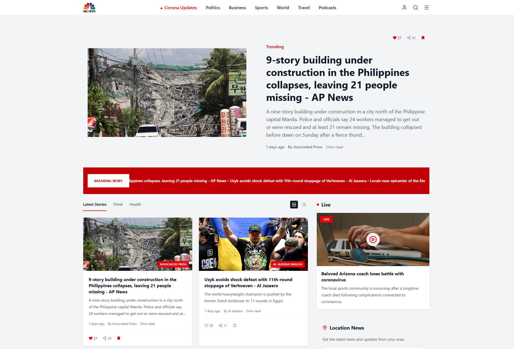
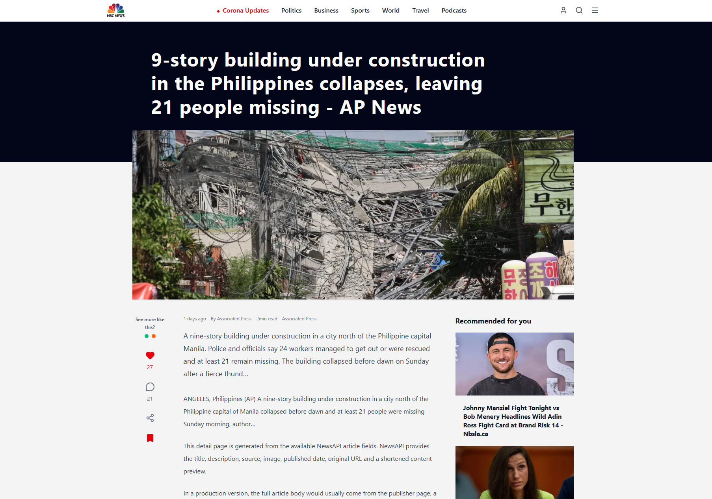

# 📰 NBC News Portal

A modern, responsive news portal built with **Next.js**, **TypeScript**, and **Tailwind CSS**.  
The application fetches real news from **NewsAPI**, displays headline sections, supports category-based browsing, and includes persistent like/bookmark actions using `localStorage`.

This project was developed as a demo-ready client presentation task for a news platform UI with real API integration.

---

## 🚀 Live Demo

🔗 **Live Demo:** [nbc-news-portal.vercel.app](https://nbc-news-portal.vercel.app/)


---

## 📸 Screenshots


### Homepage



### News Details Page



---

## 🛠️ Technologies Used

- **Next.js** — React framework for building production-ready web applications.
- **TypeScript** — Adds static typing and improves project reliability.
- **Tailwind CSS** — Utility-first CSS framework for fast and responsive UI styling.
- **NewsAPI** — Provides real news articles, headlines, sources, images, and publication data.
- **Axios** — Used for HTTP requests both in the API route and client-side hooks.
- **Lucide React** — Icon library used for UI icons such as search, menu, heart, bookmark, share, and user icons.
- **React Icons** — Used for social media icons in the footer.
- **localStorage** — Stores liked and bookmarked articles persistently in the browser.
- **sessionStorage** — Temporarily stores selected API articles so they can be displayed on the internal details page.
- **Vercel** — Deployment platform for the live demo.

---

## ✨ Features

- 🧭 Responsive navbar with news categories and action icons.
- 📰 Hero section powered by real NewsAPI data.
- 🚨 Breaking News ticker with real headlines.
- 🗂️ Latest Stories section with category tabs.
- 🔁 “View More” functionality that loads the next API page.
- 🧱 Grid/List view toggle for news cards.
- ❤️ Like system stored in `localStorage`.
- 🔖 Bookmark system stored in `localStorage`.
- 🧾 Internal details page for API articles.
- 🧠 Recommended and related news sections on the details page.
- 📍 Location News search section.
- ⏳ Loading states for API-based sections.
- ⚠️ Error states when API requests fail.
- 📱 Responsive layout for desktop and mobile screens.
- 🦶 Full footer with legal links and social icons.

---

## 📦 Installation

Follow these steps to run the project locally.

### 1. Clone the repository

```bash
git clone https://github.com/vahid2104/nbc-news-portal.git
```

### 2. Go into the project folder

```bash
cd nbc-news-portal
```

### 3. Install dependencies

```bash
npm install
```

### 4. Create environment file

Create a file named `.env.local` in the root folder:

```bash
touch .env.local
```

On Windows PowerShell:

```powershell
New-Item .env.local
```

### 5. Add environment variables

Inside `.env.local`, add:

```env
NEWS_API_KEY=your_news_api_key_here
```

Do **not** commit this file to GitHub.

### 6. Run the development server

```bash
npm run dev
```

Open the app in your browser:

```txt
http://localhost:3000
```

---

## 🔐 Environment Variables

The project requires the following environment variable:

```env
NEWS_API_KEY=
```

Only the variable name should be documented.  
The real value must stay inside `.env.local` and should never be pushed to GitHub.

---

## 🌐 API Information

This project uses **NewsAPI**.

### API Used

```txt
https://newsapi.org
```

### Main endpoint

```txt
/v2/top-headlines
```

### What the API provides

- Article title
- Description
- Source name
- Author
- Published date
- Article image URL
- Original article URL
- Short content preview

### API key usage

The API key is stored server-side in:

```txt
.env.local
```

The client never receives the real API key directly.  
Instead, the frontend requests data through a Next.js API route:

```txt
/api/news
```

### Free plan note

NewsAPI has a free developer plan with request limits and usage restrictions.  
For production use, always check the latest limits and terms on the official NewsAPI website.

---

## 🗂️ Folder Structure

```txt
software-village-news-portal/
│
├── public/
│   ├── logo/
│   │   └── logo.png
│   └── screenshots/
│       ├── homepage-desktop.png
│       └── details-desktop.png
│
├── src/
│   ├── app/
│   │   ├── api/
│   │   │   └── news/
│   │   │       └── route.ts
│   │   ├── news/
│   │   │   ├── [id]/
│   │   │   │   ├── page.tsx
│   │   │   │   ├── loading.tsx
│   │   │   │   └── not-found.tsx
│   │   │   └── article/
│   │   │       └── page.tsx
│   │   ├── globals.css
│   │   ├── layout.tsx
│   │   └── page.tsx
│   │
│   ├── components/
│   │   ├── home/
│   │   │   ├── articleCard/
│   │   │   ├── hero/
│   │   │   ├── latestStories/
│   │   │   ├── newsCard/
│   │   │   ├── rightSideBar/
│   │   │   ├── BreakingNews.tsx
│   │   │   ├── EditorsPicks.tsx
│   │   │   └── HomePage.tsx
│   │   │
│   │   ├── layout/
│   │   │   ├── navbar/
│   │   │   └── Footer.tsx
│   │   │
│   │   ├── newsDetails/
│   │   │   ├── ApiNewsDetails.tsx
│   │   │   ├── NewsDetails.tsx
│   │   │   └── newsDetails.styles.ts
│   │   │
│   │   └── ui/
│   │       ├── ActionIcons.tsx
│   │       ├── BookmarkButton.tsx
│   │       ├── LikeButton.tsx
│   │       └── ViewToggle.tsx
│   │
│   ├── hooks/
│   │   ├── useBookmark.ts
│   │   ├── useLike.ts
│   │   ├── useLocalStorageToggle.ts
│   │   ├── useInfiniteScroll.ts
│   │   └── useNews.ts
│   │
│   ├── lib/
│   │   ├── articleStorage.ts
│   │   ├── constants.ts
│   │   ├── newsHelpers.ts
│   │   └── utils.ts
│   │
│   └── types/
│       └── news.ts
│
├── .env.local
├── .gitignore
├── next.config.ts
├── package.json
├── README.md
└── tsconfig.json
```

### Folder explanation

- **`src/app`** — Next.js App Router pages, API routes, layout, loading and not-found files.
- **`src/app/api/news`** — Server-side API route that safely calls NewsAPI.
- **`src/components/home`** — Homepage sections such as hero, latest stories, breaking news, cards and sidebar.
- **`src/components/newsDetails`** — Internal news details page components.
- **`src/components/ui`** — Reusable UI elements such as like, bookmark and action icons.
- **`src/hooks`** — Custom React hooks for API fetching, localStorage actions and pagination.
- **`src/lib`** — Helper functions, constants and sessionStorage utilities.
- **`src/types`** — TypeScript types for NewsAPI articles and responses.
- **`public/screenshots`** — Screenshots used in the README.

---

## 🧪 Useful Scripts

Run development server:

```bash
npm run dev
```

Create production build:

```bash
npm run build
```

Start production server:

```bash
npm run start
```

Run linting:

```bash
npm run lint
```

---

## 🔒 Git & Security Notes

- `.env.local` must not be pushed to GitHub.
- API keys should always stay server-side.
- The project uses a Next.js API route so the NewsAPI key is not exposed in the browser.
- Bookmark and like data are safe to store in `localStorage` because they are not sensitive.

---

## ✅ Acceptance Checklist

- [x] NewsAPI key stored as `NEWS_API_KEY`.
- [x] API key handled server-side through Next.js API route.
- [x] `useNews` custom hook created.
- [x] Loading, error and data states implemented.
- [x] Hero section connected to real API data.
- [x] Latest Stories connected to real API data.
- [x] Breaking News ticker connected to real headlines.
- [x] “View More” loads more API articles.
- [x] Bookmarks stored with `article.url`.
- [x] Likes stored with `article.url`.
- [x] Internal details page created for API articles.
- [x] Recommended and related sections added.
- [x] `.env.local` ignored by Git.
- [x] README prepared with screenshots section.

---

## 👤 Author

**Vahid Aliyev**

- GitHub: [github.com/vahid2104](https://github.com/vahid2104)
- LinkedIn: https://www.linkedin.com/in/vahid-aliyev-front-end-developer

---

## 📌 Project Status

✅ Demo-ready  
🚧 Future improvements may include full article content fetching, authentication, saved articles page, advanced search, and backend database integration.
